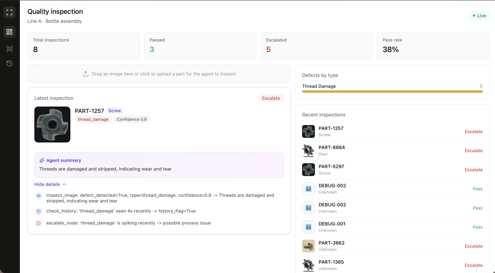

# QC Agent — Agentic Visual Quality Inspection

A LangGraph-powered agent that inspects manufacturing part images for defects, identifies the equipment type, checks recent defect history, and autonomously decides whether to pass a part or escalate it for human review — with a full, auditable reasoning trace for every decision.



## Why this is agentic, not just a classifier

Most "AI quality inspection" demos are a single model call: image in, label out. This project is built around a **LangGraph state graph** where the path through the pipeline is decided at runtime, not hardcoded:

```
inspect_image → check_history → [conditional routing] → escalate_node / pass_node
```

After the vision model looks at a part, a **conditional edge** examines the result — confidence level, defect type, and whether that defect type has been spiking recently — and routes to a different outcome accordingly. That branching decision, plus the fact that every step logs *why* it made its call, is what makes this an agent rather than a wrapped model call.

## Features

- **Visual defect detection** — a local vision-language model (LLaVA via Ollama) inspects uploaded images for cracks, scratches, corrosion, thread damage, and more
- **Equipment identification** — the agent identifies what kind of part it's looking at (screw, bolt, bottle cap, etc.), not just whether it's defective
- **History-aware escalation** — cross-references recent inspections to catch defect *spikes*, not just individual bad parts
- **Full reasoning trace** — every decision the agent makes is logged in plain language and shown in the UI, not hidden behind a single verdict label
- **Full-stack, not a notebook** — React + FastAPI + SQLite, with a real dashboard, not a Jupyter demo

## Architecture

```
┌─────────────┐      HTTP       ┌──────────────┐     LangGraph     ┌────────────────┐
│   React     │ ───────────────▶│   FastAPI    │──────────────────▶│  Agent graph   │
│  Dashboard  │◀─────────────── │   Backend    │◀───────────────── │ (LangGraph)    │
└─────────────┘                 └──────────────┘                   └────────┬───────┘
                                        │                                    │
                                        ▼                                    ▼
                                  ┌───────────┐                      ┌──────────────┐
                                  │  SQLite   │                      │ Ollama/LLaVA │
                                  │  (history)│                      │  (vision)    │
                                  └───────────┘                      └──────────────┘
```

**Backend:** Python, FastAPI, LangGraph, LangChain, Ollama (running LLaVA locally), SQLite
**Frontend:** React (Vite), Tailwind CSS, lucide-react

## Project structure

```
qc_agent/
  agent/
    state.py      — shared state schema that flows through the LangGraph graph
    tools.py       — vision inspection node (calls the local LLaVA model)
    db.py          — SQLite helpers (insert inspection, count recent defects)
    graph.py       — the LangGraph graph: nodes, conditional edge, wiring
  api.py           — FastAPI endpoints (/inspect, /history, /stats)
  main.py          — CLI entry point for running a single inspection
  requirements.txt

qc-agent-frontend/
  src/
    App.jsx                    — root component, data fetching, layout
    api.js                      — API client
    components/
      Sidebar.jsx
      StatCard.jsx
      InspectionPanel.jsx        — upload, image display, agent reasoning
      DefectBreakdown.jsx
      RecentInspections.jsx
```

## Running it locally

### Backend

```bash
# 1. Install Ollama and pull the vision model
curl -fsSL https://ollama.com/install.sh | sh
ollama pull llava

# 2. Set up the Python environment
cd qc_agent
python3 -m venv venv
source venv/bin/activate
pip install -r requirements.txt

# 3. Run the API
uvicorn api:app --reload
```

### Frontend

```bash
cd qc-agent-frontend
npm install
npm run dev
```

Open `http://localhost:5173`. Both servers need to be running simultaneously.

## Live demo

A hosted version of the UI is available at:
**https://ashita03.github.io/Quality-Inspection-Agent/**

**Note:** modern browsers enforce a security policy called Private Network Access, which blocks any public HTTPS page from making requests to a local address (`localhost`) — this applies universally, not per-visitor. The hosted link demonstrates the UI and design only; to see the agent perform a live inspection end to end, clone this repo and run both the frontend and backend locally as described above.

## Known limitations

- **Vision accuracy depends on the local model.** LLaVA is a general-purpose vision-language model, not one fine-tuned specifically for industrial defect detection — it can miss subtle defects (surface wear, minor corrosion) that a specialized model or human inspector would catch. This project prioritizes demonstrating agentic orchestration; the vision backend is intentionally swappable.
- **Inference speed** depends on local hardware, since the vision model runs on CPU/GPU locally via Ollama rather than a hosted API.
- **No persistent cloud deployment for the backend.** Free hosting tiers with enough RAM to run a local vision model reliably are limited; this is a deliberate, documented trade-off rather than an oversight.

## Possible extensions

- Swap in a fine-tuned anomaly-detection model (e.g. trained on MVTec AD) for higher defect-detection accuracy
- A second "root cause" agent that analyzes patterns across recent defects and proposes likely upstream causes
- Bounding-box localization of the defect within the image, not just a text description
